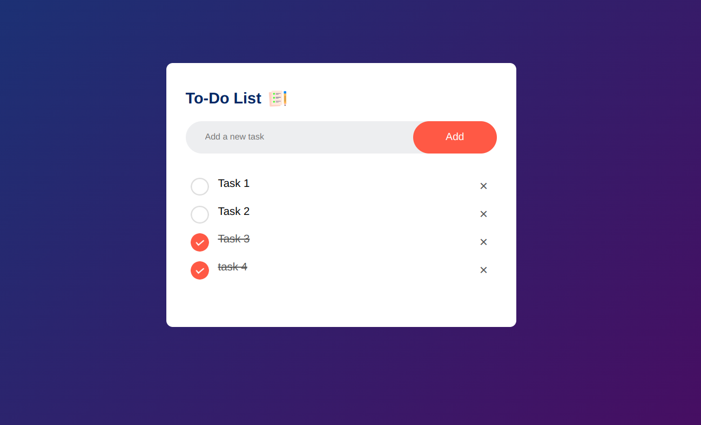

# to-do-list
A simple to do list using html+css+js

## Features

- Add tasks to the list
- Mark tasks as completed
- Delete tasks from the list
- Responsive design

## Usage

- To add a task, type the task description in the input field and press "Add".
- To mark a task as completed, click on the checkbox next to the task.
- To delete a task, click on the delete icon next to the task.
